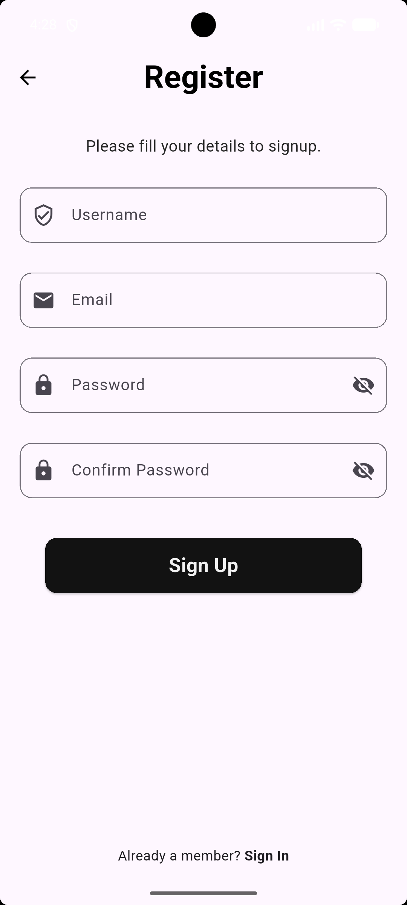
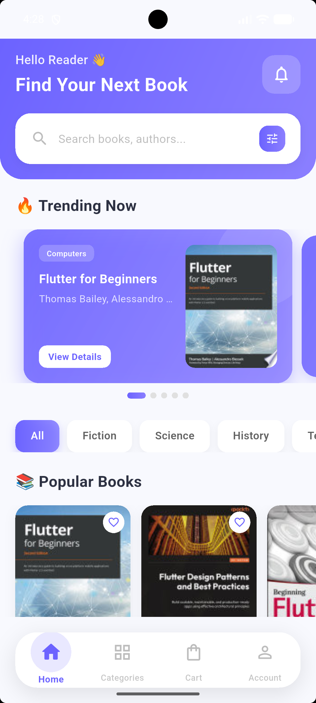
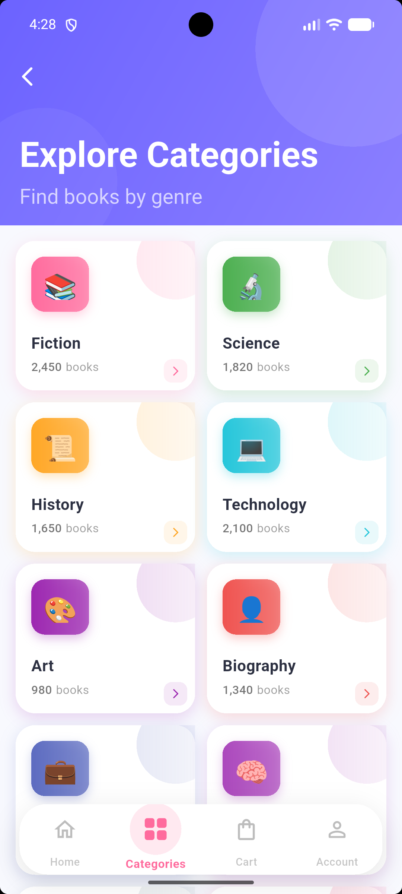
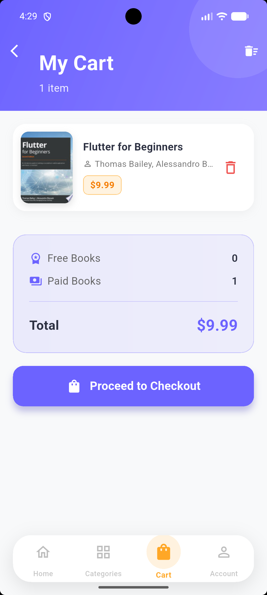
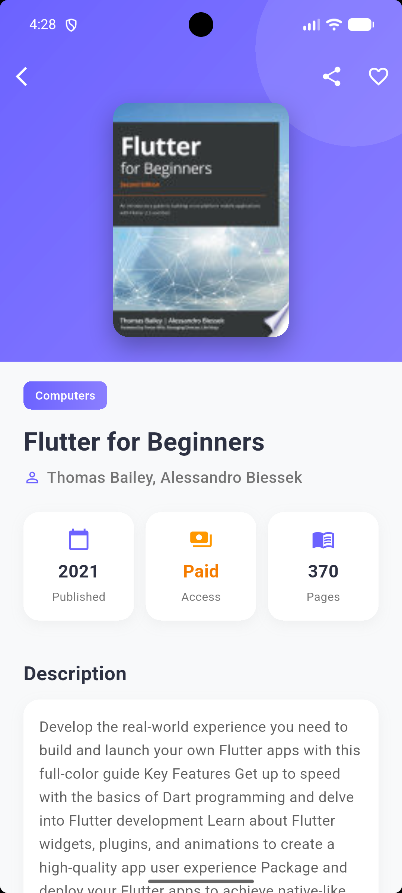
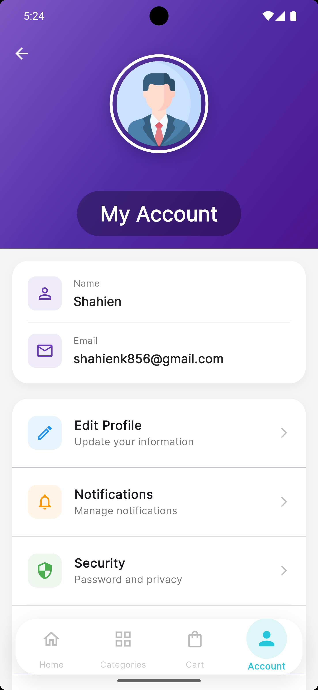
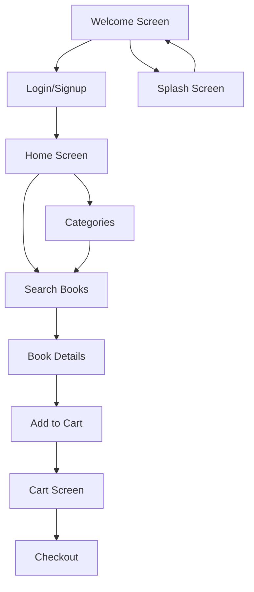

# Book App 📚

A modern Flutter application for discovering, browsing, and managing books. Built with Clean Architecture principles and Material 3 design guidelines.

## 📱 Screenshots

<p align="center">
  
  
  
  
</p>

<p align="center">
  
  
  
  
</p>

## 🌟 Features

- **Book Discovery**: Search and browse books from Google Books API
- **User Authentication**: Secure login and registration with Firebase Auth
- **Shopping Cart**: Add/remove books and manage your cart
- **Responsive UI**: Optimized for mobile, tablet, and web
- **Material 3 Design**: Modern UI with dynamic color theming
- **Clean Architecture**: Separation of concerns with feature-first structure
- **State Management**: GetX for efficient state management

## 🛠️ Technologies & Packages

- **Flutter/Dart**: Cross-platform mobile development
- **GetX**: State management and dependency injection
- **Firebase Auth**: User authentication
- **Cloud Firestore**: Data persistence
- **Dio**: HTTP client for API requests
- **Google Fonts**: Typography
- **Material 3**: Modern UI components

## 🏗️ Architecture

```
lib/
├── core/                         # Shared logic and cross-cutting concerns
│   ├── api/                      # HTTP clients and API services
│   ├── constants/                # App-wide constants & config
│   ├── errors/                   # Exceptions, failures
│   ├── helper_function/          # Helper & utility functions
│   ├── navigation/               # Router / navigation setup
│   ├── services/                 # Firebase & shared services
│   ├── theme/                    # Theme, colors, typography
│   └── widgets/                  # Reusable shared widgets
└── features/                     # Grouped by feature
    ├── account/
    │   ├── data/
    │   ├── domain/
    │   └── presentation/
    │       ├── screens/
    │       └── widgets/
    ├── cart/
    │   ├── data/
    │   ├── domain/
    │   └── presentation/
    │       ├── screens/
    │       └── widgets/
    ├── home/
    │   ├── data/
    │   ├── domain/
    │   └── presentation/
    │       ├── screens/
    │       └── widgets/
    └── ...                       # Other features
```

## 🔄 App Flow



## 🎨 UI/UX Design

- **Color Palette**:
  - Primary: #6C63FF (Purple)
  - Secondary: #8B7FFF (Light Purple)
  - Background: #F8F9FE
  - Surface: #FFFFFF

- **Typography**: Google Fonts Inter
- **Design Principles**: Material 3 with dynamic color theming
- **Responsive Layout**: Adapts to different screen sizes

## 🚀 Getting Started

### Prerequisites

- Flutter SDK (latest stable)
- Dart SDK
- Firebase project (for authentication)

### Installation

1. Clone the repository:
```bash
git clone https://github.com/yourusername/book-app.git
cd book-app
```

2. Install dependencies:
```bash
flutter pub get
```

3. Set up Firebase:
   - Create a Firebase project at https://console.firebase.google.com/
   - Add your Android/iOS app to the project
   - Download `google-services.json` (Android) or `GoogleService-Info.plist` (iOS)
   - Place the file in the appropriate directory

4. Run the app:
```bash
flutter run
```

### Configuration

- Add your Firebase configuration files to the project
- Update `lib/firebase_options.dart` with your Firebase project settings

## 📁 Project Structure

The project follows Clean Architecture with a feature-first approach:

- **Core Layer**: Shared functionality across the entire app
- **Feature Layer**: Each feature contains its own data, domain, and presentation layers
- **Data Layer**: API services, repositories, and models
- **Domain Layer**: Business logic and entities
- **Presentation Layer**: UI components and state management

## 🔐 Backend / API / Firebase Integration

- **Authentication**: Firebase Auth for user management
- **Data Storage**: Cloud Firestore for user data
- **API**: Google Books API for book data

## 📱 Responsive Design

The app is designed to work on:
- Mobile devices (iOS & Android)
- Tablets
- Web browsers
- Desktop applications

## 🧪 Testing

To run tests:
```bash
flutter test
```

## 🤝 Contributing

1. Fork the repository
2. Create a feature branch (`git checkout -b feature/amazing-feature`)
3. Commit your changes (`git commit -m 'Add some amazing feature'`)
4. Push to the branch (`git push origin feature/amazing-feature`)
5. Open a Pull Request

## 📄 License

This project is licensed under the MIT License - see the [LICENSE](LICENSE) file for details.

## 🙏 Acknowledgements

- Google Books API for book data
- Firebase for authentication and backend services
- Flutter Team for the amazing framework
- Open source community for various packages used in this project